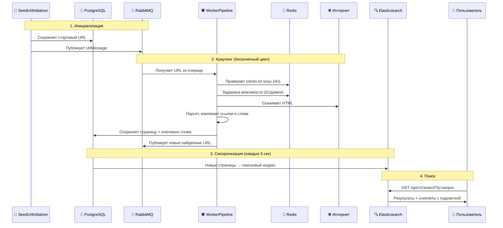

# 🕷️ Distributed Web Crawler Search

> Распределённая поисковая система с собственным веб-пауком, построенная на Java 21, Spring Boot, Elasticsearch, RabbitMQ, PostgreSQL и Redis.

<p align="center">
  
  
  
  
  
  
  
</p>

---

## 📖 О проекте

**Distributed Web Crawler Search** — это полнофункциональная распределённая поисковая система, которая автоматически обходит веб-страницы, скачивает и анализирует их содержимое, индексирует текст и предоставляет полнотекстовый поиск через красивый веб-интерфейс.

Система развёрнута в production и работает 24/7, непрерывно наращивая свою поисковую базу.

### Как это работает

```
🌐 Интернет          🕷️ Паук (Crawler)         🗄️ Хранилище           🔍 Поиск
┌──────────┐     ┌──────────────────┐     ┌──────────────────┐    ┌──────────────┐
│  Веб-    │────▶│  Скачивает HTML  │────▶│  PostgreSQL      │───▶│ Elasticsearch│
│  страницы│     │  Парсит текст    │     │  (страницы,      │    │ (полнотекст- │
│          │◀────│  Извлекает ссылки│     │   ссылки, слова) │    │  овый индекс)│
└──────────┘     └──────────────────┘     └──────────────────┘    └──────┬───────┘
                        │                                                │
                  RabbitMQ 📨                                     REST API 🌐
                 (очередь ссылок)                                        │
                                                                  ┌──────┴───────┐
                                                                  │  Веб-интер-  │
                                                                  │  фейс поиска │
                                                                  └──────────────┘
```

---

## 🏗️ Архитектура

Проект построен по принципу **Clean Architecture** и состоит из 4 Maven-модулей:

```mermaid
graph TB
    subgraph "🌐 Пользователь"
        Browser["Браузер"]
    end

    subgraph "🔍 search-api (порт 8081)"
        SC["SearchController<br/>REST API"]
        SS["SearchService<br/>Полнотекстовый поиск"]
        Sync["PostgresToElasticSyncService<br/>Синхронизация каждые 5 сек"]
        Frontend["index.html<br/>Веб-интерфейс"]
    end

    subgraph "🕷️ crawler-worker"
        Consumer["RabbitUrlConsumer<br/>Слушатель очереди"]
        Pipeline["WorkerPipeline<br/>Конвейер обработки"]
        Producer["UrlProducer<br/>Отправка новых URL"]
        Politeness["PolitenessLimiter<br/>Задержка между запросами"]
        Robots["RobotsTxtService<br/>Проверка robots.txt"]
        Seed["SeedUrlInitializer<br/>Стартовый URL"]
    end

    subgraph "⚙️ crawler-core (чистая Java, без Spring)"
        Downloader["HttpPageDownloader<br/>Скачивание HTML"]
        Parser["PageParser<br/>Парсинг (Jsoup)"]
        Links["LinkExtractor<br/>Извлечение ссылок"]
        Canon["UrlCanonicalizer<br/>Нормализация URL"]
        Filter["UrlFilter<br/>Фильтрация"]
        Keywords["KeywordExtractor<br/>Ключевые слова"]
    end

    subgraph "📦 common"
        Models["CrawlPage, CrawlUrl<br/>UrlStatus, UrlHash"]
    end

    subgraph "🗄️ Инфраструктура"
        PG["PostgreSQL 15<br/>Хранение страниц и URL"]
        RMQ["RabbitMQ 3.12<br/>Очередь URL-задач"]
        ES["Elasticsearch 8.11<br/>Поисковый индекс"]
        RD["Redis 7.2<br/>Rate limiting + кэш"]
    end

    Browser --> Frontend
    Browser --> SC
    SC --> SS
    SS --> ES
    Sync --> PG
    Sync --> ES

    Seed --> PG
    Seed --> RMQ
    RMQ --> Consumer
    Consumer --> Pipeline
    Pipeline --> Downloader
    Pipeline --> Parser
    Pipeline --> Links
    Pipeline --> Keywords
    Pipeline --> Politeness
    Pipeline --> Robots
    Pipeline --> PG
    Pipeline --> Producer
    Producer --> RMQ
    Politeness --> RD
    Robots --> RD
    Links --> Canon
    Links --> Filter

    Parser --> Models
    Downloader --> Models

    style PG fill:#4169E1,color:#fff
    style RMQ fill:#FF6600,color:#fff
    style ES fill:#005571,color:#fff
    style RD fill:#DC382D,color:#fff
    style Frontend fill:#8b5cf6,color:#fff
```



---

## 📦 Модули

### `common` — Общие модели
Базовые структуры данных, которые используются всеми модулями:

| Класс | Тип | Назначение |
|-------|-----|------------|
| `CrawlPage` | record | Неизменяемый DTO: url, title, bodyText, outLinks |
| `CrawlUrl` | record | Неизменяемый DTO: url, depth, status |
| `UrlStatus` | enum | Состояния URL: `DISCOVERED`, `CRAWLED`, `FAILED`, `SKIPPED` |
| `UrlHash` | utility | SHA-256 хеширование URL для дедупликации |

---

### `crawler-core` — Ядро краулера (чистая Java)
> ⚡ **Ноль зависимостей от Spring!** Чистая бизнес-логика, легко тестируемая.

**Скачивание страниц:**
| Класс | Назначение |
|-------|------------|
| `PageDownloader` | Интерфейс для скачивания HTML |
| `HttpPageDownloader` | Реализация на `java.net.http.HttpClient` с таймаутами и ограничением размера |
| `DownloadResult` | Sealed interface: `Success` / `Failure` — exhaustive pattern matching |
| `CrawlerConfig` | Конфигурация: таймаут (5с), User-Agent, макс. размер тела (5МБ) |

**Парсинг и извлечение:**
| Класс | Назначение |
|-------|------------|
| `PageParser` | Оркестратор: HTML → заголовок + текст + ссылки (Jsoup) |
| `LinkExtractor` | Извлечение `<a href>` ссылок с каноникализацией |
| `UrlCanonicalizer` | Нормализация URL: lowercase хост, удаление UTM-параметров, фрагментов |
| `UrlFilter` | Фильтрация: отсеивает `mailto:`, `tel:`, `javascript:`, `ftp:` |
| `KeywordExtractor` | Извлечение топ-20 ключевых слов по частотности |
| `TextTokenizer` | Токенизация: lowercase, удаление пунктуации, стоп-слова |

**In-Memory движок (для тестирования):**
| Класс | Назначение |
|-------|------------|
| `CrawlEngine` | BFS-краулер в оперативной памяти |
| `InMemoryUrlFrontier` | Очередь URL + множество посещённых |
| `InvertedIndex` | Потокобезопасный инвертированный индекс (`ConcurrentHashMap`) |
| `InMemorySearchEngine` | Простой поиск по инвертированному индексу |

---

### `crawler-worker` — Распределённый паук (Spring Boot)
Фоновый сервис, который непрерывно обходит интернет, скачивает страницы и сохраняет их в базу данных.

**Конвейер обработки (`WorkerPipeline`):**
```
URL из очереди
  → Проверка robots.txt (Redis-кэш, 24ч TTL)
  → Задержка вежливости (Redis SET NX, 2с на домен)
  → Скачивание HTML (HttpClient)
  → Парсинг (Jsoup)
  → Извлечение ключевых слов
  → Сохранение в PostgreSQL
  → Извлечение новых ссылок → отправка в RabbitMQ
```

**Ключевые компоненты:**
| Класс | Назначение |
|-------|------------|
| `WorkerPipeline` | Главный конвейер обработки URL (`@Transactional`) |
| `RabbitUrlConsumer` | `@RabbitListener` — получает URL-задачи из очереди |
| `UrlProducer` | Публикует новые URL в RabbitMQ |
| `PolitenessLimiter` | Rate limiting через Redis (SET NX + TTL 2 сек на домен) |
| `RobotsTxtService` | Проверка + кэширование robots.txt в Redis (24ч TTL) |
| `SeedUrlInitializer` | При первом запуске вбрасывает стартовый URL в систему |
| `RabbitConfig` | Настройка exchange, queue, DLQ (Dead Letter Queue) |

**Схема базы данных (Flyway):**
```sql
crawl_urls    -- Все обнаруженные URL (id, url, url_hash UNIQUE, status, discovered_at, crawled_at)
crawl_pages   -- Скачанные страницы (id, url_id FK, url, title, body_text, crawled_at)
page_keywords -- Ключевые слова (page_id FK, keyword) — PK(page_id, keyword)
```

---

### `search-api` — Поисковый API + Веб-интерфейс (Spring Boot)
REST API для полнотекстового поиска и стильный веб-интерфейс в стиле macOS-терминала.

**Компоненты:**
| Класс | Назначение |
|-------|------------|
| `SearchController` | `GET /api/v1/search?q={query}&limit={10}` — REST API поиска |
| `SearchService` | Полнотекстовый поиск через Elasticsearch (multi_match, title boost ×2, highlight) |
| `PostgresToElasticSyncService` | Каждые 5 секунд синхронизирует новые страницы из PostgreSQL в Elasticsearch |
| `PageDocument` | Elasticsearch-документ с полями: url, title, bodyText, keywords, snippet |

**Особенности поиска:**
- 🔍 **Multi-match запрос** — ищет одновременно в заголовке и тексте
- ⚖️ **Буст заголовка ×2** — совпадение в заголовке весит больше
- ✨ **Highlight (сниппеты)** — показывает фрагменты текста с выделенным искомым словом

---

## 🛠️ Технологический стек

| Категория | Технология | Версия | Назначение |
|-----------|-----------|--------|------------|
| Язык | Java | 21 | Основной язык разработки |
| Фреймворк | Spring Boot | 3.3.5 | Фреймворк приложений |
| База данных | PostgreSQL | 15 | Хранение страниц и URL |
| Поисковый движок | Elasticsearch | 8.11.1 | Полнотекстовый поисковый индекс |
| Очередь сообщений | RabbitMQ | 3.12 | Распределённая очередь URL-задач |
| Кэш | Redis | 7.2 | Rate limiting, кэш robots.txt |
| Миграции | Flyway | — | Версионирование схемы БД |
| Парсинг HTML | Jsoup | — | Извлечение текста и ссылок |
| Контейнеризация | Docker Compose | — | Оркестрация всех сервисов |
| CI/CD | GitHub Actions | — | Автоматическая сборка и тесты |

---

## 🚀 Быстрый старт

### Требования
- Java 21+
- Maven 3.9+
- Docker и Docker Compose

### Локальный запуск (для разработки)

**1. Запускаем инфраструктуру:**
```bash
docker compose up -d
```
Это поднимет PostgreSQL, RabbitMQ, Elasticsearch и Redis.

**2. Собираем проект:**
```bash
mvn clean package -DskipTests
```

**3. Запускаем Паука:**
```bash
java -jar crawler-worker/target/crawler-worker-0.1.0-SNAPSHOT.jar
```

**4. Запускаем Поисковик:**
```bash
java -jar search-api/target/search-api-0.1.0-SNAPSHOT.jar
```

**5. Открываем в браузере:**
```
http://localhost:8081
```

---

### Production-деплой (Docker Compose)

**1. Клонируем репозиторий:**
```bash
git clone https://github.com/y9matoJava/distributed-web-crawler-search.git
cd distributed-web-crawler-search
```

**2. Создаём файл с переменными окружения:**
```bash
cp .env.example .env
nano .env   # Редактируем пароли
```

**3. Запускаем всю систему:**
```bash
chmod +x deploy.sh
./deploy.sh
```

Скрипт автоматически соберёт Docker-образы и запустит все 6 контейнеров.

---

## 🔄 Поток данных (End-to-End)



---

## 📁 Структура проекта

```
distributed-web-crawler-search/
├── common/                          # 📦 Общие модели (records, enums)
│   └── src/main/java/.../common/
│       ├── CrawlPage.java           # DTO страницы
│       ├── CrawlUrl.java            # DTO ссылки
│       ├── UrlStatus.java           # Статусы: DISCOVERED/CRAWLED/FAILED/SKIPPED
│       └── UrlHash.java             # SHA-256 хеш URL
│
├── crawler-core/                    # ⚙️ Ядро краулера (чистая Java)
│   └── src/main/java/.../core/
│       ├── download/                # Скачивание HTML
│       ├── parse/                   # Парсинг и извлечение ссылок
│       ├── url/                     # Каноникализация и фильтрация URL
│       ├── keyword/                 # Извлечение ключевых слов
│       ├── search/                  # In-memory инвертированный индекс
│       └── engine/                  # In-memory BFS-краулер
│
├── crawler-worker/                  # 🕷️ Распределённый паук (Spring Boot)
│   └── src/main/java/.../worker/
│       ├── config/                  # Конфигурация бинов + Seed URL
│       ├── entity/                  # JPA-сущности (UrlEntity, PageEntity)
│       ├── repository/              # Spring Data JPA репозитории
│       ├── mq/                      # RabbitMQ: consumer, producer, config
│       ├── pipeline/                # WorkerPipeline — главный конвейер
│       └── politeness/              # Rate limiting + robots.txt
│
├── search-api/                      # 🔍 Поисковый API (Spring Boot)
│   └── src/main/java/.../search/
│       ├── controller/              # REST API
│       ├── document/                # Elasticsearch-документы
│       ├── repository/              # Elasticsearch-репозиторий
│       ├── service/                 # Поиск + синхронизация PG→ES
│       └── resources/static/        # Веб-интерфейс (index.html)
│
├── docs/                            # 📚 Документация проекта
├── docker-compose.yml               # 🐳 Локальная инфраструктура
├── docker-compose.prod.yml          # 🚀 Production (все сервисы)
├── deploy.sh                        # 📜 Скрипт деплоя
├── .env.example                     # 🔐 Пример переменных окружения
├── .github/workflows/               # ⚡ GitHub Actions CI
└── pom.xml                          # 📋 Корневой Maven POM
```

---

## 🔌 API

### Поиск

```http
GET /api/v1/search?q={запрос}&limit={количество}
```

| Параметр | Тип | По умолчанию | Описание |
|----------|-----|-------------|----------|
| `q` | string | — | Поисковый запрос (обязательный) |
| `limit` | int | 10 | Количество результатов |

**Пример ответа:**
```json
[
  {
    "id": "42",
    "url": "https://ru.wikipedia.org/wiki/Java",
    "title": "Java — Википедия",
    "bodyText": "...",
    "keywords": ["java", "язык", "программирование"],
    "snippet": "...объектно-ориентированный язык <b>программирования</b>, разработанный компанией..."
  }
]
```

---

## 🧪 Тестирование

Проект содержит юнит-тесты для всех ключевых компонентов ядра:

```bash
# Запуск всех тестов
mvn test

# Тесты конкретного модуля
mvn test -pl crawler-core
```

| Модуль | Тестируемые компоненты |
|--------|----------------------|
| `common` | UrlHash |
| `crawler-core` | HttpPageDownloader, InMemoryUrlFrontier, KeywordExtractor, TextTokenizer, LinkExtractor, PageParser, InMemorySearchEngine, InvertedIndex, UrlCanonicalizer, UrlFilter |

---

## ⚙️ Конфигурация

Переменные окружения (файл `.env`):

| Переменная | Описание | Пример |
|-----------|----------|--------|
| `POSTGRES_DB` | Имя базы данных | `crawler` |
| `POSTGRES_USER` | Пользователь PostgreSQL | `crawler_user` |
| `POSTGRES_PASSWORD` | Пароль PostgreSQL | `your_secure_password` |
| `RABBITMQ_DEFAULT_USER` | Пользователь RabbitMQ | `rabbit_user` |
| `RABBITMQ_DEFAULT_PASS` | Пароль RabbitMQ | `your_secure_password` |
| `ELASTICSEARCH_JAVA_OPTS` | Память для Elasticsearch | `-Xms512m -Xmx512m` |
| `SPRING_PROFILES_ACTIVE` | Профиль Spring | `prod` |

---

## 📚 Документация

Подробная документация находится в папке [`docs/`](docs/):

| Документ | Описание |
|---------|----------|
| [architecture.md](docs/architecture.md) | Архитектура системы |
| [roadmap.md](docs/roadmap.md) | Дорожная карта разработки |
| [api.md](docs/api.md) | Спецификация REST API |
| [local-dev.md](docs/local-dev.md) | Настройка локального окружения |
| [web-crawler-notes.md](docs/web-crawler-notes.md) | Заметки по алгоритмам краулера |
| [responsible-crawling.md](docs/responsible-crawling.md) | Ответственный краулинг (robots.txt, rate limiting) |
| [testing.md](docs/testing.md) | Стратегия тестирования |

---

## 🏛️ Архитектурные принципы

- **Clean Architecture** — ядро краулера (`crawler-core`) не зависит от Spring. Все интеграции происходят через `CoreBeansConfig` в `crawler-worker`.
- **Sealed Interfaces** — `DownloadResult` (Success/Failure) для исчерпывающего pattern matching.
- **Records** — Неизменяемые DTO повсюду (CrawlPage, CrawlUrl, ParsedPage, UrlMessage, CrawlerConfig).
- **Event-Driven** — RabbitMQ с паттерном producer/consumer для распределённой обработки URL.
- **Dead Letter Queue** — Сообщения, которые не удалось обработать, автоматически попадают в DLQ.
- **Flyway Migrations** — Схема базы данных версионируется через SQL-миграции.
- **Politeness Policy** — Per-domain rate limiting через Redis (2 сек) + robots.txt (кэш 24 часа).

---

