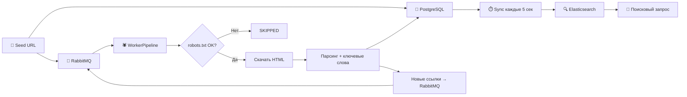

# 🏗️ Архитектура системы

## Обзор

Distributed Web Crawler Search — распределённая поисковая система, построенная по принципам Clean Architecture.

---

## Модульная структура

```
                    ┌────────────────────┐
                    │    common           │
                    │  (модели и DTO)     │
                    └──────┬─────────────┘
                           │
              ┌────────────┼────────────┐
              │            │            │
    ┌─────────▼──────┐   ┌─▼────────────▼───────┐
    │  crawler-core   │   │     search-api        │
    │  (чистая Java)  │   │  (Spring Boot 8081)   │
    └─────────┬───────┘   └───────────────────────┘
              │
    ┌─────────▼───────┐
    │ crawler-worker   │
    │  (Spring Boot)   │
    └──────────────────┘
```

### common
Общие модели данных, используемые всеми модулями:
- `CrawlPage` — неизменяемый DTO страницы (url, title, bodyText, outLinks)
- `CrawlUrl` — DTO ссылки (url, depth, status)
- `UrlStatus` — enum состояний URL (DISCOVERED → CRAWLED / FAILED / SKIPPED)
- `UrlHash` — SHA-256 хеширование URL для дедупликации

### crawler-core
Чистая бизнес-логика краулера **без зависимостей от Spring**:
- **Скачивание:** `HttpPageDownloader` — HTTP-клиент с таймаутами и лимитами
- **Парсинг:** `PageParser` — извлечение заголовка, текста и ссылок через Jsoup
- **URL-обработка:** `UrlCanonicalizer` + `UrlFilter` — нормализация и фильтрация
- **Ключевые слова:** `KeywordExtractor` — топ-20 слов по частотности
- **In-memory движок:** `CrawlEngine` + `InvertedIndex` — BFS-краулер для тестов

### crawler-worker
Распределённый паук на Spring Boot:
- **RabbitMQ consumer/producer** — получение и публикация URL-задач
- **WorkerPipeline** — конвейер: robots.txt → politeness → download → parse → save → enqueue
- **JPA-сущности** — `UrlEntity`, `PageEntity` (PostgreSQL + Flyway)
- **PolitenessLimiter** — per-domain rate limiting через Redis (2 сек)
- **RobotsTxtService** — проверка и кэширование robots.txt (24ч TTL)

### search-api
Поисковый сервис на Spring Boot:
- **SearchService** — полнотекстовый поиск через Elasticsearch (multi_match + highlights)
- **PostgresToElasticSyncService** — синхронизация PG → ES каждые 5 секунд
- **REST API** — `GET /api/v1/search?q={query}`
- **Веб-интерфейс** — стильная страница в стиле macOS-терминала

---

## Инфраструктура

| Сервис | Назначение |
|--------|------------|
| **PostgreSQL 15** | Хранение URL, страниц и ключевых слов (master data) |
| **RabbitMQ 3.12** | Очередь URL-задач + Dead Letter Queue для ошибок |
| **Elasticsearch 8.11** | Полнотекстовый поисковый индекс |
| **Redis 7.2** | Rate limiting (per-domain), кэш robots.txt |

---

## Ключевые паттерны

| Паттерн | Применение |
|---------|------------|
| Clean Architecture | crawler-core без Spring, интеграция через CoreBeansConfig |
| Sealed Interfaces | DownloadResult (Success / Failure) |
| Records | Неизменяемые DTO: CrawlPage, CrawlUrl, ParsedPage, UrlMessage |
| Event-Driven | RabbitMQ producer/consumer для обработки URL |
| Dead Letter Queue | Автоматическая маршрутизация неудачных сообщений |
| Flyway Migrations | Версионирование схемы БД через SQL-миграции |
| Scheduled Sync | PostgreSQL → Elasticsearch каждые 5 секунд |

---

## Поток данных

